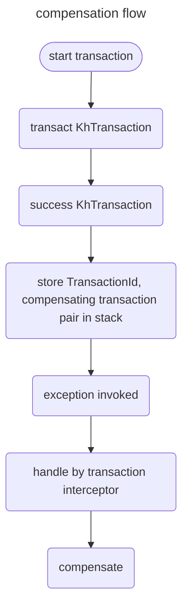
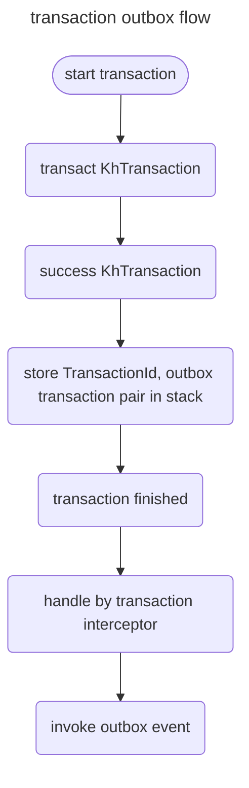
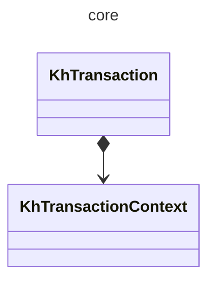
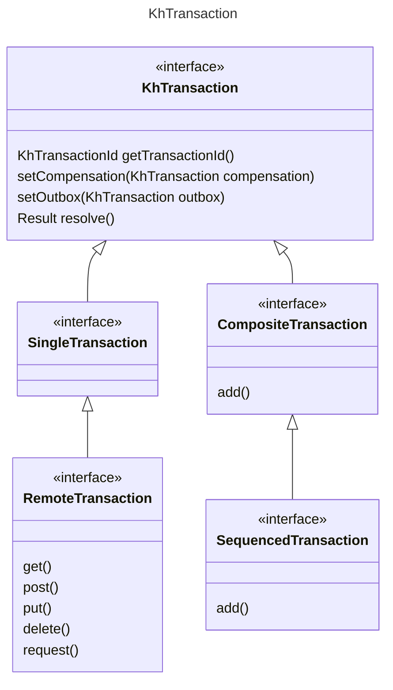
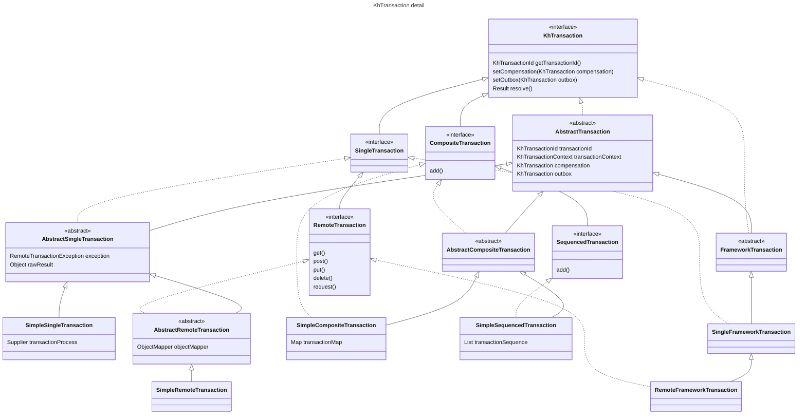
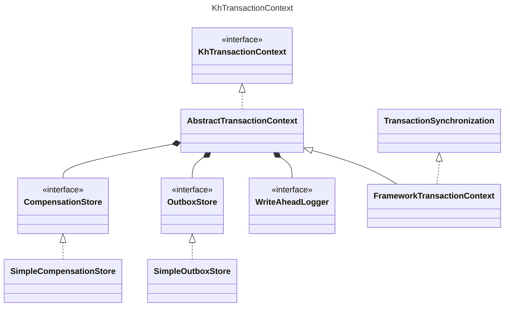

# KeyHub Distributed Transaction Kit

- KhTransaction은 애플리케이션 레벨에서 분산 트랜잭션을 처리하기 위해 만들어졌습니다.
- 관심사를 묶으세요.
  - 하나의 작업에 대한, 트랜잭션 이후의 작업과 관심사를 묶을 수 있습니다.
  - 전체 트랜잭션의 성공은 하나의 작업에 대한 처리와 관심사가 멀죠.
- KhTransaction은 다음과 같은 기능을 제공합니다:
1. 보상 트랜잭션
2. Outbox 트랜잭션

## 기능

- KhTransaction은 레이지한 동작을 합니다.
- resolve 시점에 실제 동작이 이뤄지며, 
- resolve 완료시, 보상 트랜잭션과 outbox 트랜잭션의 실행을 트랜잭션 컨텍스트에 저장합니다.
- resolve에 실패하면, 보상 트랜잭션과 outbox 트랜잭션을 실행하지 않습니다.

### 1. 보상 트랜잭션

- 하나의 작업과 
- 트랜잭션이 실패했을 때, 실행할 보상 트랜잭션을 묶으세요.
- 작업은 성공 했지만, 작업이 속한 트랜잭션이 실패했을때, 보상 트랜잭션을 실행합니다.



### 2. Outbox 트랜잭션

- 하나의 작업과
- 트랜잭션의 성공 이후, 실행할 Outbox 트랜잭션을 묶으세요.
- 작업의 성공과 더불어, 작업이 속한 트랜잭션이 성공했을때, Outbox 트랜잭션을 실행합니다.



- 정상 동작 사례 (outbox 동작)

```java
@Service
public class TransactionService {
    
    @Transactional
    public String transactSample() {
        FrameworkTransaction utd = SingleFrameworkTransaction.of(()->{
                    String sample = "Hello World!";
                    log.info(sample);
                    return sample;
                })
                .setOutbox(SingleFrameworkTransaction.of(() -> {
                    String outboxMessage = "It's outbox!";
                    log.info(outboxMessage);
                    return outboxMessage;
                }));
        return utd.resolve()
                .get(String.class);
    }
}
```

- 보상 사례

```java
@Service
public class TransactionTestService {
    @Transactional
    public String invokeOutboxSample() {
        FrameworkTransaction utd = SingleFrameworkTransaction.of(()->{
                    String sample = "Hello World!";
                    log.info(sample);
                    return sample;
                })
                .setCompensation(SingleFrameworkTransaction.of(()->{
                    String compensationMessage = "It's compensation!";
                    log.info(compensationMessage);
                    return compensationMessage;
                }));
        var result = utd.resolve()
                .get(String.class);
        invokeException();
        return result;
    }

    private void invokeException(){
        throw new RuntimeException("I need Exception!");
    }
}
```

---

## Transaction Context

- KhTransaction은 기존 Spring Transaction에 동기화됩니다.
  - Transaction에 의해 관리된다면, 인터셉터가 Transaction을 바라보도록 트랜잭션 범위를 확장
  - 없다면, 단일 트랜잭션으로 처리



## 트랜잭션의 종류

- Transaction은 다음과 같은 상속 관계로 구성됩니다.



### 1. KhTransaction

- 모든 트랜잭션의 부모 인터페이스입니다.

### 2. SingleTransaction

- 단일 트랜잭션 인터페이스입니다.
- `SingleFrameworkTransaction` 구현체를 통해 스프링 트랜잭션과 통합됩니다.
- 예제:

```java
@Transactional
public String invokeOutboxSample() {
  
    // do other process...
  
    String result = utd()
            .setCompensation(compensation())
            .setOutbox(outbox())
            .resolve()
            .get();
  
    // do other process...
  
    return result;
}

KhTransaction utd() {
    return SingleFrameworkTransaction.of(()->{
      String sample = "Hello World!";
      log.info(sample);
      return sample;
    });
}

KhTransaction compensation() {
  return SingleFrameworkTransaction.of(()->{
    String compensationMessage = "It's compensation!";
    log.info(compensationMessage);
    return compensationMessage;
  });
}

KhTransaction outbox() {
    return SingleFrameworkTransaction.of(() -> {
        String outboxMessage = "It's outbox!";
        log.info(outboxMessage);
        return outboxMessage;
    });
}
```

### 3. RemoteTransaction

- 원격 REST API 요청 기능을 지원하는 단일 트랜잭션 인터페이스입니다.
- `RemoteFrameworkTransaction` 구현체를 통해 스프링 트랜잭션과 통합됩니다.
- 예제:

```java
@Transactional
public Map<String, String> invokeOutboxSample() throws KhTransactionException {
  Map<String, String> result = utd(baseUrl)
          .setCompensation(utd(baseUrl))
          .setOutbox(utd(baseUrl))
          .resolve()
          .get(Map.class);
  log.info(result.toString());
  return result;
}

KhTransaction utd(String baseUrl) {
  return RemoteFrameworkTransaction.of()
          .get(baseUrl)
          .header("Content-Type", "application/json");
}
```

### 4. CompositeTransaction

- 복합 트랜잭션 인터페이스입니다.
- `CompositeFrameworkTransaction` 구현체를 통해 스프링 트랜잭션과 통합됩니다.
- KhTransaction을 묶을 수 있습니다.
  - 묶인 트랜잭션들의 실행 순서를 보장하지 않습니다.
  - 재귀적 동작도 가능합니다.
- 예제

```java
@Transactional
public void compensateSample() throws KhTransactionException {
  var failTransaction = failSingle("I will be fail!");
  CompositeFrameworkTransaction.of(
                  single("1"),
                  single("I will compensate1!").setCompensation(single("compensation1")).setOutbox(single("no outbox1"))
          ).setOutbox(single("no outbox3"))
          .setCompensation(single("compensation2"))
          .resolve();
  single("I will compensate3!").setCompensation(single("compensation3")).resolve();
  throw new RuntimeException();
  CompositeFrameworkTransaction.of(
          single("no1"),
          single("no2").setCompensation(single("no compensation1")).setOutbox(single("no outbox4"))
  ).resolve();
}

KhTransaction single(String message){
  return SingleFrameworkTransaction.of(()->{
    log.info(message);
    return message;
  });
}

KhTransaction failSingle(String message){
  return SingleFrameworkTransaction.of(()->{
    log.info(message);
    throw new RuntimeException("fail");
  });
}
```

### 5. SequencedTransaction

- 순서 보장 복합 트랜잭션 인터페이스입니다.
- `SequencedFrameworkTransaction` 구현체를 통해 스프링 트랜잭션과 통합됩니다.
- KhTransaction을 순서대로 묶을 수 있습니다.
  - 묶인 트랜잭션들의 실행 순서를 보장합니다.
  - 재귀적 동작도 가능합니다.
- 예제

```java
@Transactional
public void compensateSample() throws KhTransactionException {
  var failTransaction = failSingle("I will be fail!");
  SequencedFrameworkTransaction.of(
                  single("1"),
                  single("I will compensate1!").setCompensation(single("compensation1")).setOutbox(single("no outbox1"))
          ).setOutbox(single("no outbox3"))
          .setCompensation(single("compensation2"))
          .resolve();
  single("I will compensate3!").setCompensation(single("compensation3")).resolve();
  throw new RuntimeException();
  SequencedFrameworkTransaction.of(
          single("no1"), 
          single("no2").setCompensation(single("no compensation1")).setOutbox(single("no outbox4"))
  ).resolve();
}

KhTransaction single(String message){
  return SingleFrameworkTransaction.of(()->{
    log.info(message);
    return message;
  });
}

KhTransaction failSingle(String message){
  return SingleFrameworkTransaction.of(()->{
    log.info(message);
    throw new RuntimeException("fail");
  });
}
```

---



