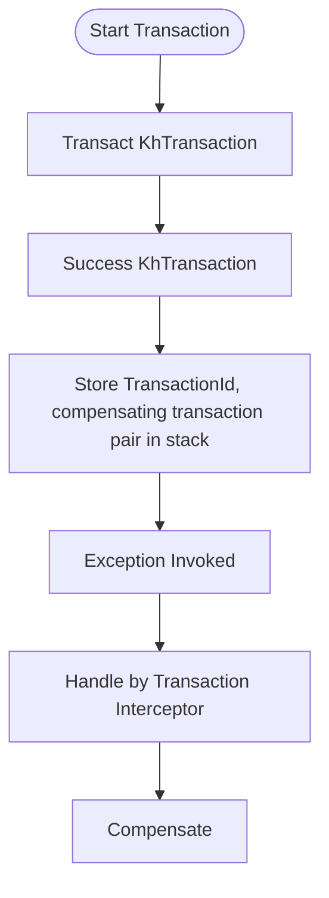
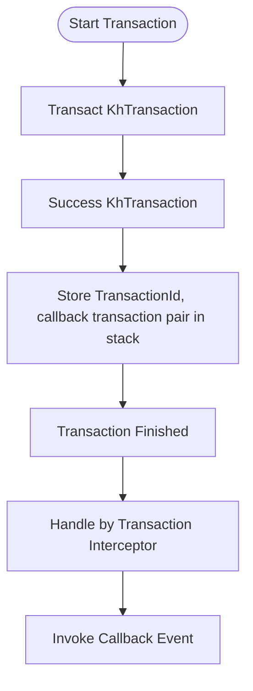
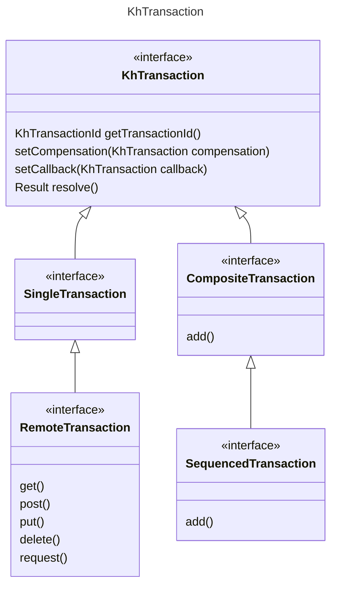
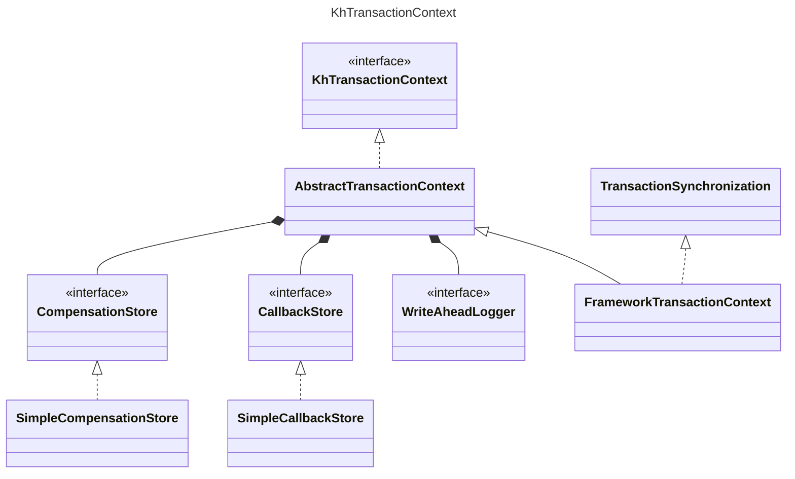

# KeyHub Distributed Transaction Kit

The **KeyHub Distributed Transaction Kit (KhTransaction)** is a framework designed to efficiently handle **distributed transactions at the application level**. It provides **compensating transactions** and **callback transactions**, ensuring reliable and scalable transaction management.

<details>
  <summary>Choose Language</summary>

- [🇬🇧 English (README.md)](README.md)
- [🇰🇷 한국어 (README.ko.md)](README.ko.md)
</details>

---

## 📚 Table of Contents

1. [Project Overview](#project-overview)
2. [Key Features](#key-features)
3. [Quick Start](#quick-start)
4. [Transaction Flow](#transaction-flow)
5. [Transaction Types](#transaction-types)
6. [Exception Handling & Limitations](#exception-handling--limitations)
7. [Use Cases](#use-cases)

---

## Project Overview

**KhTransaction** is designed to effectively handle various scenarios (success and failure) that may occur during transaction processing. It guarantees the following:

- **Compensating Transactions**: Rollback operations when a transaction fails.
- **Callback Transactions**: Executes follow-up actions after a successful transaction.
- **Seamless Integration with Spring Transactions**: Smoothly integrates with existing transaction management.

---

## Key Features

- **Compensating Transactions**: Recovery operations executed when a transaction fails.
- **Callback Transactions**: Post-processing operations executed after a successful transaction.
- **Transaction Context Synchronization**: Synchronizes with Spring transaction management.
- **Complex Transaction Support**: Provides interfaces for managing complex transaction flows.

---

## Quick Start

### 1. **Add Dependencies**

- [Maven Repository](https://mvnrepository.com/artifact/io.github.keyhub-projects/distributed-transaction-kit-starter)

#### Maven

```xml
<!-- https://mvnrepository.com/artifact/io.github.keyhub-projects/distributed-transaction-kit-core -->
<dependency>
    <groupId>io.github.keyhub-projects</groupId>
    <artifactId>distributed-transaction-kit-core</artifactId>
    <version>0.0.5</version>
    <type>pom</type>
</dependency>
```

#### Gradle

```gradle
// https://mvnrepository.com/artifact/io.github.keyhub-projects/distributed-transaction-kit-core
implementation 'io.github.keyhub-projects:distributed-transaction-kit-core:0.0.5'
```

### 2. **Enable Transaction Management**

```java
@EnableKhTransaction
@SpringBootApplication
public class StarterApplication {
   public static void main(String[] args) {
       SpringApplication.run(StarterApplication.class, args);
   }
}
```

### 3. **Usage Example**

```java
@Service
public class TransactionService {
    @Transactional
    public String transactSample() {
       SingleTransaction utd = SingleFrameworkTransaction.of(() -> {
                    String sample = "Hello, Transaction!";
                    log.info(sample);
                    return sample;
                })
                .setCompensation(SingleFrameworkTransaction.of(() -> {
                    String compensationMessage = "Compensation!";
                    log.info(compensationMessage);
                    return compensationMessage;
                }))
                .setCallback(SingleFrameworkTransaction.of(() -> {
                    String callbackMessage = "Callback executed!";
                    log.info(callbackMessage);
                    return callbackMessage;
                }));
        return utd.resolve().get(String.class);
    }
}
```

---

## Transaction Flow

### Compensating Transaction Flow



### Callback Transaction Flow



---

## Transaction Types



### 1. **KhTransaction**

- The base interface for all transactions.

### 2. **SingleTransaction**

- A single transaction interface.
- Integrated with Spring transactions.

```java
SingleTransaction utd() {
    return SingleFrameworkTransaction.of(() -> {
        String sample = "Hello World!";
        log.info(sample);
        return sample;
    });
}
```

### 3. **RemoteTransaction**

- A transaction integrated with REST API requests.

```java
RemoteTransaction utd(String baseUrl) {
    return RemoteFrameworkTransaction.of()
            .get(baseUrl)
            .header("Content-Type", "application/json");
}
```

### 4. **CompositeTransaction**

- Manages multiple transactions as a group.
- Does not guarantee execution order.

```java
@Transactional
public void executeCompositeTransaction() throws KhTransactionException {
    CompositeFrameworkTransaction.of(
            single("1"),
            single("I will compensate1!")
                .setCompensation(single("compensation1"))
                .setCallback(single("no callback1"))
        )
        .setCallback(single("no callback3"))
        .setCompensation(single("compensation2"))
        .resolve();

    single("I will compensate3!")
            .setCompensation(single("compensation3"))
            .resolve();

    throw new RuntimeException("CompositeTransaction failed");

    // The following code will not execute (due to exception)
    CompositeFrameworkTransaction.of(
           single("no1"),
           single("no2")
               .setCompensation(single("no compensation1"))
               .setCallback(single("no callback4"))
       ).resolve();
}
```

### 5. **SequencedTransaction**

- A composite transaction that guarantees execution order.

```java
@Transactional
public void executeSequencedTransaction() throws KhTransactionException {
    SequencedFrameworkTransaction.of(
            single("1"),
            single("I will compensate1!")
                .setCompensation(single("compensation1"))
                .setCallback(single("no callback1"))
        )
        .setCallback(single("no callback3"))
        .setCompensation(single("compensation2"))
        .resolve();

    single("I will compensate3!")
        .setCompensation(single("compensation3"))
        .resolve();
    
    throw new RuntimeException("SequencedTransaction failed");

    // The following code will not execute (due to exception)
    SequencedFrameworkTransaction.of(
           single("no1"),
           single("no2")
               .setCompensation(single("no compensation1"))
               .setCallback(single("no callback4"))
       ).resolve();
}
```

---

## Exception Handling & Limitations

1. **Failure in Compensating Transaction Execution**
    - If a compensating transaction fails, it should be logged and managed separately.

2. **Errors in Callback Transaction Execution**
    - If a callback transaction fails, consider implementing a retry mechanism or using a message queue.

---

## Use Cases

- **E-commerce**: Handling payment approval and cancellation upon failure.
- **Event-driven Systems**: Sending events to a message broker (Kafka, RabbitMQ) after transaction completion.
- **Inventory Management**: Managing stock reduction transactions with rollback handling.

---

With this guide, you can effectively leverage the **KeyHub Distributed Transaction Kit**. Contributions and feedback are always welcome! 🚀


