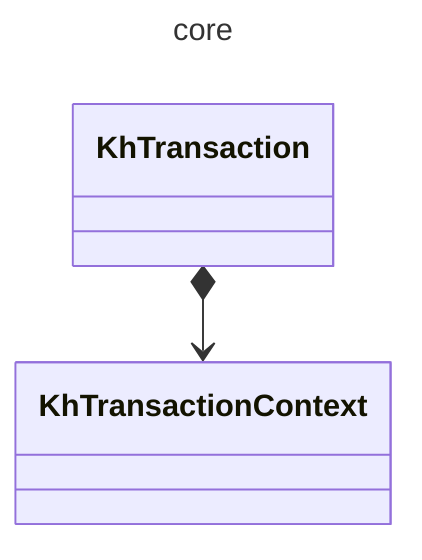
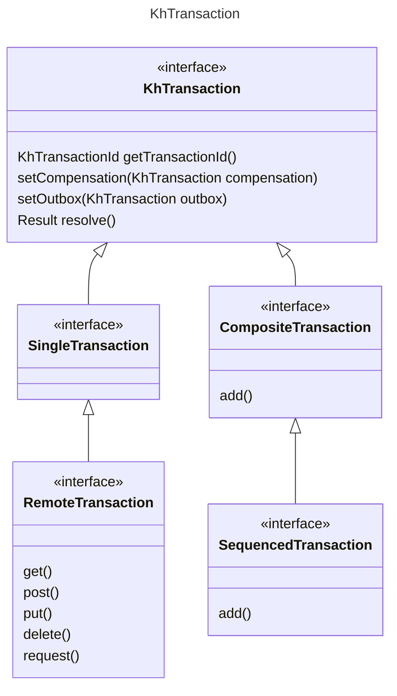
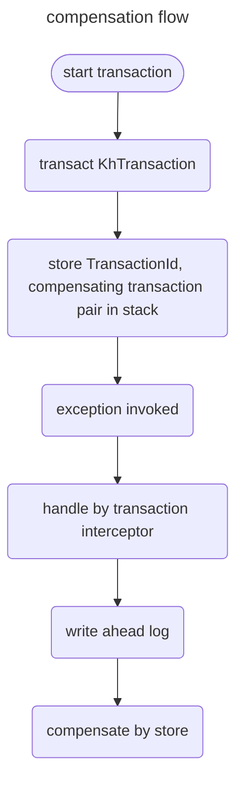
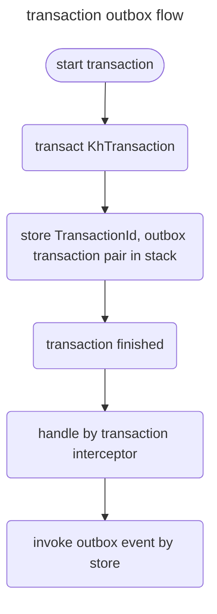
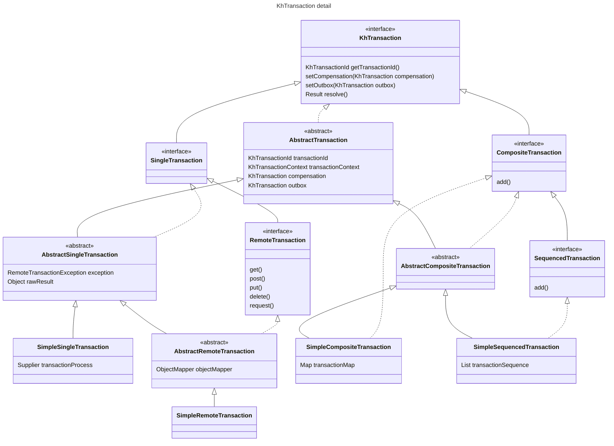
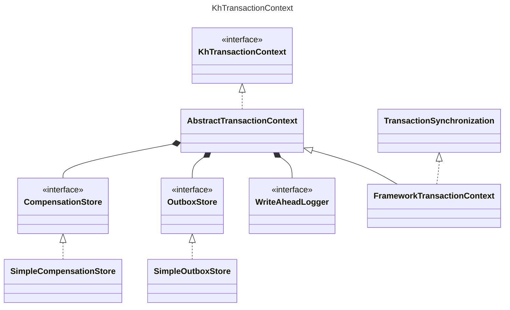

# KeyHub Distributed Transaction Kit

```mermaid
---
title: core
---
classDiagram
    class KhTransaction
    
    class KhTransactionContext
    KhTransaction *--> KhTransactionContext

```

```mermaid
---
title: KhTransaction
---
classDiagram
    class KhTransaction {
        KhTransactionId getTransactionId()
        setCompensation(KhTransaction compensation)
        setOutbox(KhTransaction outbox)
        Result resolve()
    }
    <<interface>> KhTransaction
    
    class SingleTransaction {
    }
    <<interface>> SingleTransaction
    KhTransaction <|-- SingleTransaction
    
    class RemoteTransaction {
        get()
        post()
        put()
        delete()
        request()
    }
    <<interface>> RemoteTransaction
    SingleTransaction <|-- RemoteTransaction

    class CompositeTransaction {
        add()
    }
    KhTransaction <|-- CompositeTransaction
    <<interface>> CompositeTransaction

    class SequencedTransaction {
        add()
    }
    <<interface>> SequencedTransaction
    CompositeTransaction <|-- SequencedTransaction
```

```mermaid
---
title: compensation flow
---
flowchart
    start([start transaction])
    transaction(transact KhTransaction)
    storeTransactionId(store TransactionId, compensating transaction pair in stack)
    exception(exception invoked)
    handleByInterceptor(handle by transaction interceptor)
    wal(write ahead log)
    compensateByStore(compensate by store)
    start --> transaction --> storeTransactionId --> exception --> handleByInterceptor --> wal --> compensateByStore
```

```mermaid
---
title: transaction outbox flow
---
flowchart
    start([start transaction])
    transaction(transact KhTransaction)
    storeTransactionId(store TransactionId, outbox transaction pair in stack)
    finishTransaction(transaction finished)
    handleByInterceptor(handle by transaction interceptor)
    invokeOutboxEventByStore(invoke outbox event by store)
    start --> transaction --> storeTransactionId --> finishTransaction --> handleByInterceptor --> invokeOutboxEventByStore
```

- Transaction에 의해 관리된다면, 인터셉터가 Transaction을 바라보도록 트랜잭션 범위를 확장한다.
- 없다면 단일 트랜잭션으로 처리

```mermaid
---
title: KhTransaction detail
---
classDiagram
    class KhTransaction {
        KhTransactionId getTransactionId()
        setCompensation(KhTransaction compensation)
        setOutbox(KhTransaction outbox)
        Result resolve()
    }
    <<interface>> KhTransaction
    
    class AbstractTransaction {
        KhTransactionId transactionId
        KhTransactionContext transactionContext
        KhTransaction compensation
        KhTransaction outbox
    }
    <<abstract>> AbstractTransaction
    KhTransaction <|.. AbstractTransaction
    
    class SingleTransaction {
    }
    <<interface>> SingleTransaction
    KhTransaction <|-- SingleTransaction
    
    class AbstractSingleTransaction {
        RemoteTransactionException exception
        Object rawResult
    }
    <<abstract>> AbstractSingleTransaction
    SingleTransaction <|.. AbstractSingleTransaction
    AbstractTransaction <|-- AbstractSingleTransaction
    
    class SimpleSingleTransaction {
        Supplier<R> transactionProcess
    }
    AbstractSingleTransaction <|-- SimpleSingleTransaction
    
    
    class RemoteTransaction {
        get()
        post()
        put()
        delete()
        request()
    }
    <<interface>> RemoteTransaction
    SingleTransaction <|-- RemoteTransaction
    
    class AbstractRemoteTransaction {
        ObjectMapper objectMapper
    }
    <<abstract>> AbstractRemoteTransaction
    RemoteTransaction <|.. AbstractRemoteTransaction
    AbstractSingleTransaction <|-- AbstractRemoteTransaction

    class SimpleRemoteTransaction {
    }
    AbstractRemoteTransaction <|-- SimpleRemoteTransaction


    class CompositeTransaction {
        add()
    }
    KhTransaction <|-- CompositeTransaction
    <<interface>> CompositeTransaction

    class AbstractCompositeTransaction {
        
    }
    <<abstract>> AbstractCompositeTransaction
    CompositeTransaction <|.. AbstractCompositeTransaction
    AbstractTransaction <|-- AbstractCompositeTransaction

    class SimpleCompositeTransaction {
        Map<KhTransactionId, KhTransaction> transactionMap
    }
    CompositeTransaction <|.. SimpleCompositeTransaction
    AbstractCompositeTransaction <|-- SimpleCompositeTransaction

    class SequencedTransaction {
        add()
    }
    <<interface>> SequencedTransaction
    CompositeTransaction <|-- SequencedTransaction

    class SimpleSequencedTransaction {
        List<KhTransactionId> transactionSequence
    }
    SequencedTransaction <|.. SimpleSequencedTransaction
    AbstractCompositeTransaction <|-- SimpleSequencedTransaction
```

```mermaid
---
title: KhTransactionContext
---
classDiagram
    class KhTransactionContext {
    }
    <<interface>> KhTransactionContext
    
    class AbstractTransactionContext {
    }
    KhTransactionContext <|.. AbstractTransactionContext
    
    class CompensationStore {
    }
    <<interface>> CompensationStore
    
    class SimpleCompensationStore {
    }
    CompensationStore <|.. SimpleCompensationStore
    AbstractTransactionContext *-- CompensationStore
    
    class OutboxStore {
    }
    <<interface>> OutboxStore
    
    class SimpleOutboxStore {
    }
    OutboxStore <|.. SimpleOutboxStore
    AbstractTransactionContext *-- OutboxStore
    
    class WriteAheadLogger {
    }
    <<interface>> WriteAheadLogger
    AbstractTransactionContext *-- WriteAheadLogger

    class FrameworkTransactionContext {
    }
    AbstractTransactionContext <|-- FrameworkTransactionContext
    TransactionSynchronization <|.. FrameworkTransactionContext
```