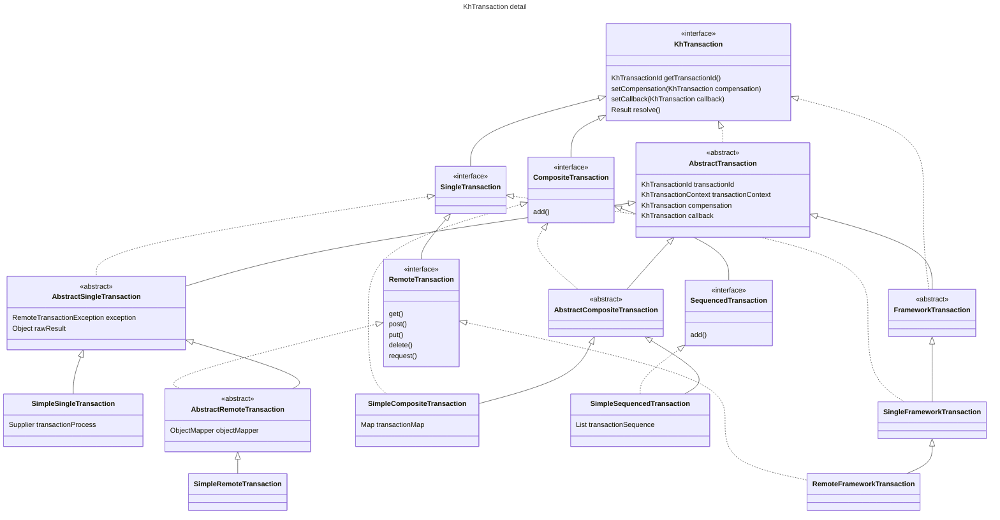

# KeyHub Distributed Transaction Kit

KeyHub Distributed Transaction Kit (KhTransaction)은 애플리케이션 레벨에서 분산 트랜잭션을 효과적으로 처리하기 위한 프레임워크입니다. 보상 트랜잭션 및 Callback 트랜잭션을 제공하며, 안정적이고 확장 가능한 트랜잭션 관리 기능을 지원합니다.

---

## 📚 목차

1. [프로젝트 소개](#프로젝트-소개)
2. [주요 기능](#주요-기능)
3. [빠른 시작](#빠른-시작)
4. [트랜잭션 흐름](#트랜잭션-흐름)
5. [트랜잭션 유형](#트랜잭션-유형)
6. [예외 처리와 제한 사항](#예외-처리와-제한-사항)
7. [유스 케이스](#유스-케이스)

---

## 프로젝트 소개

KhTransaction은 트랜잭션 처리 중 발생할 수 있는 다양한 상황(성공, 실패)을 효과적으로 관리하기 위해 설계되었습니다. 이를 통해 다음을 보장합니다:

- **보상 트랜잭션**: 작업 실패 시 원상 복구를 수행.
- **Callback 트랜잭션**: 트랜잭션 성공 이후 후속 작업 실행.
- **Spring 트랜잭션과 통합**: 기존 트랜잭션 관리와 매끄럽게 연동.

---

## 주요 기능

- **보상 트랜잭션**: 트랜잭션 실패 시 실행되는 복구 작업.
- **Callback 트랜잭션**: 트랜잭션 성공 후 실행되는 후속 작업.
- **트랜잭션 컨텍스트 동기화**: Spring 트랜잭션 관리와 동기화.
- **복합 트랜잭션 지원**: 복잡한 트랜잭션 흐름을 관리할 수 있는 인터페이스 제공.

---

## 빠른 시작

### 1. **의존성 추가**

- [Maven Repository](https://mvnrepository.com/artifact/io.github.keyhub-projects/distributed-transaction-kit-starter)

#### Maven

```xml
<!-- https://mvnrepository.com/artifact/io.github.keyhub-projects/distributed-transaction-kit-core -->
<dependency>
    <groupId>io.github.keyhub-projects</groupId>
    <artifactId>distributed-transaction-kit-core</artifactId>
    <version>0.0.4</version>
    <type>pom</type>
</dependency>
```

#### Gradle

```gradle
// https://mvnrepository.com/artifact/io.github.keyhub-projects/distributed-transaction-kit-core
implementation 'io.github.keyhub-projects:distributed-transaction-kit-core:0.0.4'
```

### 2. **트랜잭션 관리 활성화**

```java
@EnableKhTransaction
@SpringBootApplication
public class StarterApplication {
   public static void main(String[] args) {
       SpringApplication.run(StarterApplication.class, args);
   }
}
```

### 3. 사용 예시

```java
@Service
public class TransactionService {
    @Transactional
    public String transactSample() {
        FrameworkTransaction utd = SingleFrameworkTransaction.of(() -> {
                    String sample = "Hello, Transaction!";
                    log.info(sample);
                    return sample;
                })
                .setCompensation(SingleFrameworkTransaction.of(() -> {
                    String compensationMessage = "Compensation!";
                    log.info(compensationMessage);
                    return compensationMessage;
                }))
                .setCallback(SingleFrameworkTransaction.of(() -> {
                    String callbackMessage = "Callback executed!";
                    log.info(callbackMessage);
                    return callbackMessage;
                }));
        return utd.resolve().get(String.class);
    }
}
```

---

## 트랜잭션 흐름

### 보상 트랜잭션 흐름


### Callback 트랜잭션 흐름


---

## 트랜잭션 유형


### 1. **KhTransaction**

- 모든 트랜잭션의 부모 인터페이스.

### 2. **SingleTransaction**

- 단일 트랜잭션 인터페이스.
- Spring 트랜잭션과 통합.

```java
SingleTransaction utd() {
    return SingleFrameworkTransaction.of(() -> {
        String sample = "Hello World!";
        log.info(sample);
        return sample;
    });
}
```

### 3. **RemoteTransaction**

- REST API 요청과 통합된 트랜잭션.

```java
RemoteTransaction utd(String baseUrl) {
    return RemoteFrameworkTransaction.of()
            .get(baseUrl)
            .header("Content-Type", "application/json");
}
```

### 4. **CompositeTransaction**

- 여러 트랜잭션을 묶어 관리.
- 실행 순서를 보장하지 않음.

```java
@Transactional
public void executeCompositeTransaction() throws KhTransactionException {
    CompositeFrameworkTransaction.of(
                    single("1"),
                    single("I will compensate1!")
                            .setCompensation(single("compensation1"))
                            .setCallback(single("no callback1"))
            )
            .setCallback(single("no callback3"))
            .setCompensation(single("compensation2"))
            .resolve();

    single("I will compensate3!")
            .setCompensation(single("compensation3"))
            .resolve();

    throw new RuntimeException("CompositeTransaction failed");
    
    // 아래 코드는 실행되지 않음 (예외 발생으로 인해)
    CompositeFrameworkTransaction.of(
    single("no1"),
    single("no2")
                    .setCompensation(single("no compensation1"))
                    .setCallback(single("no callback4"))
    ).resolve();
}
```

### 5. **SequencedTransaction**

- 실행 순서를 보장하는 복합 트랜잭션.

```java
@Transactional
public void executeSequencedTransaction() throws KhTransactionException {
    SequencedFrameworkTransaction.of(
                    single("1"),
                    single("I will compensate1!")
                            .setCompensation(single("compensation1"))
                            .setCallback(single("no callback1"))
            )
            .setCallback(single("no callback3"))
            .setCompensation(single("compensation2"))
            .resolve();

    single("I will compensate3!")
            .setCompensation(single("compensation3"))
            .resolve();
    
    throw new RuntimeException("SequencedTransaction failed");

    // 아래 코드는 실행되지 않음 (예외 발생으로 인해)
    SequencedFrameworkTransaction.of(
    single("no1"),
    single("no2")
                    .setCompensation(single("no compensation1"))
                    .setCallback(single("no callback4"))
    ).resolve();
}
```

---

## 예외 처리와 제한 사항

1. **보상 트랜잭션 실행 실패**
  - 보상 트랜잭션이 실패하면 로그를 남기고 해당 상태를 별도로 관리해야 합니다.

2. **Callback 트랜잭션 실행 중 오류**
  - Callback 작업이 실패하면 재시도 로직을 구현하거나 별도의 큐를 활용해야 합니다.

---

## 유스 케이스

- **전자상거래**: 결제 승인 및 실패 시 결제 취소 처리.
- **이벤트 기반 시스템**: 트랜잭션 완료 후 메시지 브로커(Kafka, RabbitMQ)로 이벤트 전송.
- **재고 관리**: 재고 감소 트랜잭션과 실패 시 복구 처리.

---

위 내용을 기반으로 KeyHub Distributed Transaction Kit을 효과적으로 활용할 수 있습니다. 피드백이나 기여는 언제나 환영합니다!




